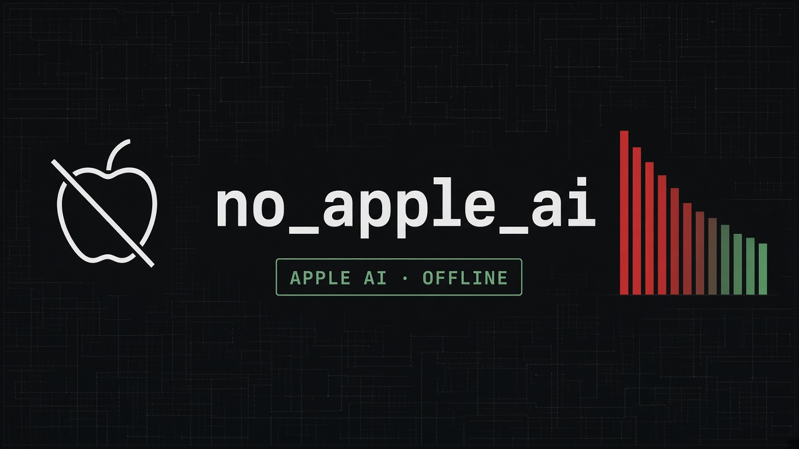

<p align="center">
  
</p>

<p align="center">
  <strong>Cut Apple Intelligence / Siri RAM on macOS.</strong><br/>
  No Homebrew. No third-party tools. Pure bash.
</p>

<p align="center">
  
  
  
  
  
</p>

---

## Quick start

```bash
curl -fsSL -o disable-apple-ai.sh \
  https://raw.githubusercontent.com/nevenkordic/no_apple_ai/main/disable-apple-ai.sh
chmod +x disable-apple-ai.sh
./disable-apple-ai.sh
```

Or jump straight in:

```bash
./disable-apple-ai.sh disable medium
./disable-apple-ai.sh status
```

---

## What you get

| | |
|---|---|
| **Prefs** | Turns Siri / Assistant off the same way System Settings does |
| **Agents** | Disables Apple Intelligence / Siri LaunchAgents |
| **Kill** | Stops running AI-ish processes |
| **Guard** | User + root watchdogs re-kill leftovers every 30s |
| **Nuclear** | With SIP off: disables `modelmanagerd` + `modelcatalogd` |

<p align="center">
  
</p>

---

## Levels

Pick how aggressive you want to be:

| Level | Scope | Best when |
|:-----:|-------|-----------|
| `soft` | Prefs only | Trying it safely |
| `medium` ★ | Prefs + agents + kill + **guard** | Everyday use |
| `hard` | Medium + sudo kill | Stubborn processes |
| `nuclear` | Hard + system AI daemons | SIP already off, max reclaim |

```bash
./disable-apple-ai.sh disable soft
./disable-apple-ai.sh disable medium
./disable-apple-ai.sh disable hard
./disable-apple-ai.sh disable nuclear   # requires SIP disabled
```

---

## Guard (keep leftovers dead)

Some AI helpers are on-demand XPCs — not LaunchAgents — so they can respawn:

- `IntelligencePlatformComputeService`
- `ANECompilerService` *(root)*
- `SiriAUSP` / `SiriSetupSettingsIntents`

`medium` / `hard` / `nuclear` install both:

| Guard | Runs as | Target |
|-------|---------|--------|
| `local.disable-apple-ai.guard` | you | user leftovers |
| `local.disable-apple-ai.guard-root` | root | ANE / root XPCs |

```bash
./disable-apple-ai.sh guard-install
./disable-apple-ai.sh guard-status
DISABLE_APPLE_AI_GUARD_INTERVAL=15 ./disable-apple-ai.sh guard-install
```

---

## Useful commands

```bash
./disable-apple-ai.sh status              # prefs / agents / guard / RAM verdict
./disable-apple-ai.sh kill [--sudo]       # one-shot kill
./disable-apple-ai.sh turn-off-siri       # CLI prefs only
./disable-apple-ai.sh turn-off-siri-ui    # also clicks Settings (Accessibility)
./disable-apple-ai.sh reenable            # undo prefs + agents + guards
./disable-apple-ai.sh nuclear-undo        # reverse nuclear daemons
./disable-apple-ai.sh animate             # boot animation demo
./disable-apple-ai.sh selftest
```

---

## Nuclear (SIP off)

> Does **not** damage hardware. It **does** weaken OS security while SIP stays off.

1. Recovery Terminal → `csrutil disable` → reboot  
2. `./disable-apple-ai.sh nuclear` → type `NUCLEAR`  
3. Keep SIP off for it to stick  

Undo: `./disable-apple-ai.sh nuclear-undo` then Recovery → `csrutil enable`.

---

## Notes

- Use at your own risk. **Read the script** before running.
- Killing AI pieces can briefly break **Spotlight / Apps** — restart Spotlight if the Dock Apps icon won't open.
- Skip animation: `DISABLE_APPLE_AI_NO_ANIM=1 ./disable-apple-ai.sh disable medium`
- Not affiliated with Apple Inc. “Apple”, “Siri”, and “Apple Intelligence” are trademarks of Apple Inc. This project is an independent utility that only configures/stops local processes on *your* Mac.

---

## License

[MIT](LICENSE) — © 2026 Neven Kordić

Provided **as is**, with **no warranty**. You are responsible for how you use it (including SIP / system changes).

---

<p align="center">
  <sub>macOS · bash · no Homebrew · MIT</sub>
</p>
